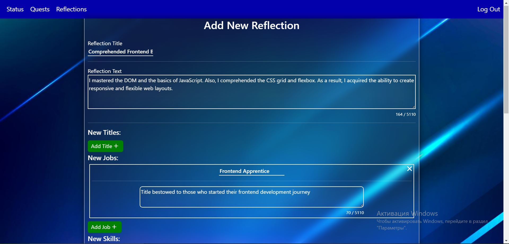
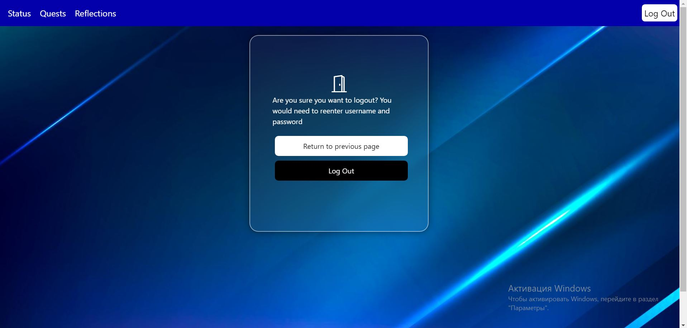

## Programmer Status site
This site allows the programmer to gamify his own study process 
by having his own skills, stats and titles, 
like a game character. User needs to write a 
reflection to change his stats, add 
skills e.g. and also user can create quests 
to set study or work goals. You can ask ChatGPT to create descriptions for quests, skills, titles, job e.g.

### Login page

### Status page

### Quest page

### Mobile Version

### Reflections page

### Reflection creation

### Logout page

#### Background image of this site was designed by Freepik
[Link to background images](https://www.freepik.com/free-photos-vectors/blue-gaming-background)
